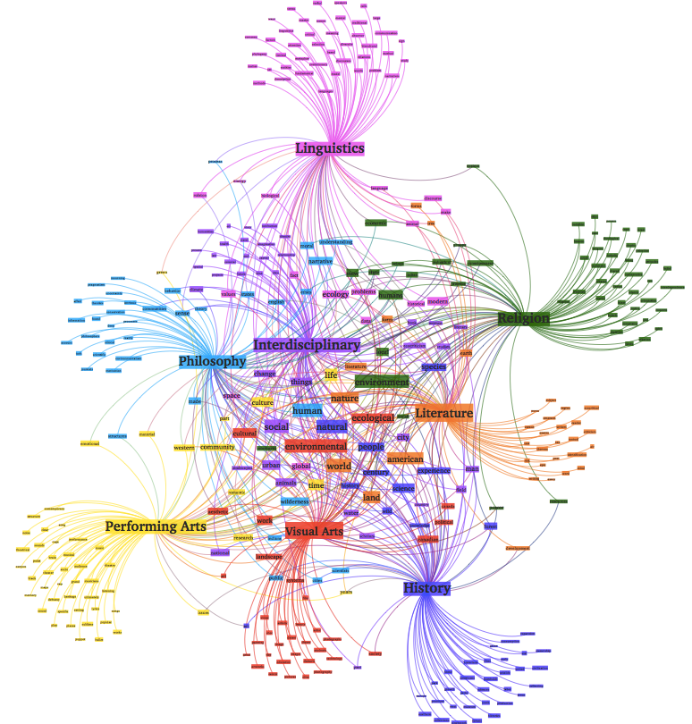

# Topic Modelling with Python 📚🔍



Welcome to the captivating world of "Topic Modelling with Python"! 🚀 In this repository, we embark on an exciting journey to unravel the hidden narratives within text data using powerful topic modelling techniques. Whether you're a curious beginner or a seasoned data explorer, this repository is your ultimate guide to mastering topic modelling with Python. Let's dive in and discover the magic of words! 🌟

## Table of Contents 📑

- [Introduction to Topic Modelling](#introduction-to-topic-modelling)
- [Getting Started](#getting-started)
  - [Prerequisites](#prerequisites)
  - [Installation](#installation)
- [Understanding Topic Modelling](#understanding-topic-modelling)
  - [🔍 What is Topic Modelling?](#what-is-topic-modelling)
  - [🤔 Why Use Topic Modelling?](#why-use-topic-modelling)
  - [🎯 Common Techniques](#common-techniques)
- [Implementation](#implementation)
  - [Data Preprocessing](#data-preprocessing)
  - [Latent Dirichlet Allocation (LDA)](#latent-dirichlet-allocation-lda)
  - [Non-Negative Matrix Factorization (NMF)](#non-negative-matrix-factorization-nmf)
  - [Evaluation of Topics](#evaluation-of-topics)
- [Advanced Topics](#advanced-topics)
  - [Topic Coherence](#topic-coherence)
  - [Optimizing Model Parameters](#optimizing-model-parameters)
  - [Visualizing Topics](#visualizing-topics)
- [Resources 📚](#resources)
- [Contributing 🤝](#contributing)
- [License ⚖️](#license)

## Introduction to Topic Modelling 📖

Dive into the fascinating realm of "Topic Modelling with Python"! 🌐📊 Unveil the art of extracting hidden themes and uncovering the essence of text documents. Whether you're a linguistics enthusiast or a tech aficionado, this repository is your launchpad into the captivating world of topic modelling.

## Getting Started 🚀

### Prerequisites 🛠️

Before we embark on this journey, ensure you're equipped with the following:

- Python (>= 3.6)
- Jupyter Notebook (for interactive exploration)
- A pinch of curiosity and enthusiasm!

### Installation ⚙️

1. Begin your adventure by cloning this repository to your command center:

   ```
   git clone https://github.com/your-username/topic-modelling-python.git
   cd topic-modelling-python
   ```

2. Forge your virtual haven (optional but highly recommended):

   ```
   python -m venv venv
   source venv/bin/activate  # Windows: venv\Scripts\activate
   ```

3. Infuse power by installing the required magic spells (a.k.a. packages):

   ```
   pip install -r requirements.txt
   ```

## Understanding Topic Modelling 🔍

### 🔍 What is Topic Modelling?

Imagine peering into the heart of a text and extracting its soulful themes—this is topic modelling! 🧠✨ Unveil the latent structure within documents, assigning words to topics based on their secret alliances. Each document is a blend of topics, and each topic, a mosaic of words.

### 🤔 Why Use Topic Modelling?

Why wield the power of topic modelling, you ask? Well, it's the compass that guides us through the wilderness of unstructured data! 🌄🧭 From content curation to sentiment exploration, topic modelling empowers us to decipher the unseen patterns of words.

### 🎯 Common Techniques

Embark on the exploration of two majestic topic modelling techniques:

- **Latent Dirichlet Allocation (LDA)**: A probabilistic masterpiece that envisions documents as a symphony of topics, and each topic as a harmonious blend of words.
- **Non-Negative Matrix Factorization (NMF)**: The alchemy of linear algebra, conjuring topics from the matrix of terms and documents.

## Implementation 🛠️

### Data Preprocessing 🧹

Before the grand unveiling, we must prepare the stage! 🎭 Tasks like tokenization, spell-checking (just kidding), and text cleaning await us. Libraries like `nltk` and `spaCy` shall be our loyal companions.

### Latent Dirichlet Allocation (LDA) 🌌

The grand act begins! 🎉 With the enigmatic `gensim` library, we shall summon LDA and unveil its treasures. Select topics, weave words, and conjure insights from the depths of your data.

### Non-Negative Matrix Factorization (NMF) 🔮

Enter the mystical realm of NMF with the wise `scikit-learn` at your side. Decompose matrices, decipher documents, and welcome forth the enchanting topics within.

### Evaluation of Topics 📊

Before we bow to our newfound knowledge, we must ensure its elegance. Metrics like coherence scores shall be our guiding stars, validating the harmony of our topics.

## Advanced Topics 🚀

### Topic Coherence 🌐

Dive deeper into the sea of coherence—where topics resonate like melodies. 🎶 Measure and enhance the interpretability of your topics using coherence scores, illuminating the path to brilliance.

### Optimizing Model Parameters 🎛️

A journey is incomplete without fine-tuning! 🛠️ Embark on the quest to find the perfect number of topics and unveil the secrets of perplexity scores.

### Visualizing Topics 📊

Don't let your insights stay confined! 📈 Utilize tools like `pyLDAvis` to paint your topics on a canvas of interactivity, making your discoveries a feast for the eyes.

## Resources 📚

Delve into the treasure trove of our `resources` directory! 📚 Explore datasets, notebooks, and additional readings to fuel your thirst for knowledge.

## Contributing 🤝

Unlock the power of collaboration! ✨ Feel the urge to enhance, correct, or expand? Open issues or conjure pull requests to contribute your magic to this repository.

## License ⚖️

This repository's magic is protected under the wings of the MIT License—dive in, explore, and share the enchantment far and wide.

---

Prepare to embark on an epic journey through the realm of topic modelling! 🌟 Let the words guide you as you explore, learn, and create with the power of Python and the allure of hidden topics. Your adventure awaits! 🚀🔮
